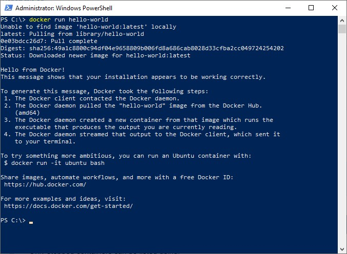
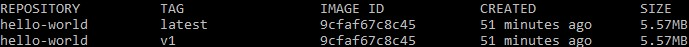

# Workshop Instructions

## Part 1 - Running a Docker container

### Hello, World
We're going to start simple by running a single docker container.

```bash
$ docker run hello-world
```

If successful you should see something like this, which helpfully explains exactly what docker has done.


If you are having problems check these two things:
1. That Docker Desktop is running
2. That you are running your docker commands with elevated permissions.

We can see some evidence for the steps that docker has taken to print this message using the following commands:

```bash
# List the images that docker currently has in its local cache.
# It should only display the 'hello-world' image.
$ docker image list

# List all containers currently running.
# It should be empty.
$ docker container list

# List all containers.
# It should show that your hello-world container exited recently. 
$ docker container list --all
```
You'll notice that Docker has assigned a randomly-generated name to the container (the last column in the above output). This is the default behaviour for docker run unless you specify a container name using the `--name` option.

### Hello, nginx

Now let's try something slightly more complicated. Running a common web server (nginx) in a container:

```bash
$ docker run --publish 8080:80 nginx
```

Here, we've declared that port 80 on the container should be bound, or published, to port 8080 on your host machine (note the slightly confusing syntax for declaring the port mapping, i.e. host:container). Now point your browser at <http://localhost:8080/> and you should see the nginx start page.

In the above command, we're asking Docker to create and run a new container based on the nginx image. Docker runs the container application in the foreground (in this case, the Nginx web server) and prints any output from that application directly to your terminal. To stop the container, type control-C.

Docker first looks for an image tagged "nginx" on your local machine. If none exists, it will pull an appropriate image from [Docker Hub](https://hub.docker.com/).

Now run the container again, this time using the `--detach` option to run it in the background instead:
```bash
$ docker run --detach --publish 8080:80 nginx
```

When containers run in the background, you can view their output using `docker logs <container_name>` (where `<container_name>` is the name of the container). Finally, let's stop the container and remove it:

```bash
$ docker container stop <container_name>
$ docker container rm <container_name>
```

## Part 2 - Write a dockerfile

Now we've seen docker working, let us build a dockerfile. We'll use an example from the reading material. In a new directory, create a file called `Dockerfile` with the following content.

```dockerfile
FROM alpine
ENTRYPOINT ["echo", "Hello World"]
```

Then build and run it with the following command. The `.` is important; it's the build context and refers to the current directory.
```bash
$ docker build --tag hello-world .
$ docker run hello-world
```

You should see something like this:
```
$ docker build --tag hello-world .
Sending build context to Docker daemon  2.048kB
Step 1/2 : FROM alpine
latest: Pulling from library/alpine
df20fa9351a1: Pull complete
Digest: sha256:185518070891758909c9f839cf4ca393ee977ac378609f700f60a771a2dfe321
Status: Downloaded newer image for alpine:latest
 ---> a24bb4013296
Step 2/2 : ENTRYPOINT ["echo", "hello world"]
 ---> Running in ee94d1da8d4b
Removing intermediate container ee94d1da8d4b
 ---> 9cfaf67c8c45
Successfully built 9cfaf67c8c45
Successfully tagged hello-world:latest
$ docker run hello-world
hello world
```

You should also be able to see your image in the output of `docker image list`:


Let's add another tag to our image.

```bash
$ docker tag hello-world hello-world:v1
```

Now you should see something more like this:



Note: while we have a new entry the image ID is the same. Both the `v1` and `latest` tag are pointing at the same image.

Now change your Dockerfile to make it print a new message and build it again. You should see that the `latest` tag now has a different image ID. This should emphasise that even though your Dockerfile is mutable, the images produced are not.

## Part 3: Publish an Image

To see how Docker image registries work in practice, let's push the hello-world image we created earlier to Docker Hub.

First you'll need to create an account on Docker Hub, if you don't have one already. You can create one [here](https://hub.docker.com/signup).

Now you need to give the Docker CLI your login credentials so it can pull and push images to your account. From a terminal, run:

```bash
$ docker login
```

and enter your username and password when prompted. If successful, you should see a "Login Succeeded" message printed to the terminal.

Before you can push the hello-world image to Docker Hub, you need to associate it with your account by prefixing the image name with your account username. You can do this by creating a new image tag that points to the existing image:
```bash
$ docker tag hello-world <your_username>/hello-world
```
(Make sure you replace <your_username> with your Docker Hub username!)

Running `docker image ls` should now show two entries, hello-world and <your_username>/hello-world that both have the same image ID.

We can now push that image to Docker Hub:
```bash
$ docker push <your_username>/hello-world
```
Once the image has been pushed, the command will print out the unique digest (hash) for that image.

Visit your Docker Hub account in a web browser and you should see a new public repository has been created for your hello-world image. Click on that entry to see more details about the repository, including available tags.

You could create additional builds of the hello-world image and tag them with version numbers, then upload those to the same repository, e.g.

```bash
$ docker build --tag <your_username>/hello-world:1.0 .
$ docker push <your_username>/hello-world:1.0
```

## Part 4: Dockerise Chimera

Now for something more complicated. In Module 04 we worked with a legacy application called the Chimera Reporting Server. In the remainder of this exercise we are going to convert that application to using Docker. This process is sometimes called "dockerising" or "containerising" an application.

Fortunately, we already have dockerfiles for each part of the application. You can find these in [./dockerfiles](./dockerfiles). 

This application will run slightly differently to the previous module. The `webapp` container will still serve a simple website, but the `cliapp` container behaves slightly differently. From reading the dockerfile and associated script can you work out what it will do?

To complete this section you then need to complete the following tasks:

### 01: Build the containers
You will need to build each container separately using `docker build`. Make sure you choose an appropriate tag.

Hint: you may find the `-f` option helpful.

### 02: Run the containers
Running each container with `docker run` is fairly straightfoward. However, the containers will need a way to communicate; we suggest you create and `--mount` a **shared volume**. You'll also need to `--publish` a port if you want to see your handywork.

### 03: Refactor and improve!
The Dockerfiles and bash script we've provided you aren't as good as they could be. Spend a little time trying to improve them before moving onto the next exercise.

To get started, take a look at docker's official [best practices guide for writing Dockerfiles](https://docs.docker.com/develop/develop-images/dockerfile_best-practices/).

## Part 5: Docker Compose
In the previous section we ended up constructing some reasonably long command line statements to build, configure and run our containers. This is error prone and doesn't scale well; consider how fiddly it was with just two containers!

Fortunately there are tools that can help us automate these processes. We are going to use one called Docker Compose. You may already have this installed. Check by runing `docker-compose --version` in your shell. (If not, you can find installation instructions [here](https://docs.docker.com/compose/install/)).

To use docker compose you create a YAML file called `docker-compose.yml` that describes the **services** you want; how to build them; and what volumes, ports and other settings you want to run them with. (For the purposes of this exercise you can consider services to be synonymous with containers.)

When you have completed your YAML file you build and run all your containers with a single command: `docker-compose up`.

You may find the following reference material helpful:
* [Compose file reference](https://docs.docker.com/compose/compose-file/)
* [Docker compose cheat sheet](https://devhints.io/docker-compose)

We've provided you with a _very_ minimal docker compose file below. Using the reference material above and your answers to part 4 complete the file so you that you can reproduce the same result as part 4 with only a single `docker-compose up` command?

```yaml
# Copy this into a file called `docker-compose.yml`
version: "3"

services:
  cliapp:
    TODO: COMPLETE THIS
  webapp:
    TODO: COMPLETE THIS

volumes:
  TODO: COMPLETE THIS      
```

## Part 6: Redis
In this part of the workshop we will demonstrate how easy it is to add new functionality using containers. Chimera can be configured to use [Redis](https://redis.io/topics/introduction), an in-memory data store, as an alternative to the data folder in the shared volume. (Redis is more sophisticated than a basic file system; we might want to use it as a remote cache, or take advantage of its messaging brokering features. You don't need to understand the features of Redis for the purposes of this exercise, but do read about it if you're interested.)

To do this you need to set two environment variables (`REDIS_HOST` and `REDIS_PORT`) for both the `webapp` and `cliapp`. You'll also need to call `cliapp` with the `-r` flag to enable redis mode. Finally, you should remove the shared data volume from docker-compose and the Dockerfiles - you won't need it anymore!

You will need to:
 * Find a Redis image on [Docker Hub](https://hub.docker.com/) and add it to your docker-compose file as a service.
 * Set `REDIS_PORT` to the default port 6379
 * Set `REDIS_HOST` to the host name of the redis container
 * Ensure that the `-r` flag is passed to `cliapp` on the command line.

Hint: to rebuild your containers you may need to call docker-compose with the `--build` flag, e.g.

```bash
$ docker-compose up --build
```

## Part 7: nginx (stretch)
Docker-compose lets us rearchitect applications very easily. In this part your task is to introduce [nginx](https://www.nginx.com/), a very lightweight webserver, in front of the webapp. This will give us more control over the incoming traffic.

In this case we want to introduce `nginx` and use its rewrite functionality to change the URLs used to access the map. Specifically, we want to only serve maps if the user visits an endpoint starting `/maps/dataset/`. For example, visiting `localhost:8080/maps/dataset/all_hour` should return the `all_hour` dataset.

Any requests that do not start `/maps/dataset` should result in an HTTP 404 error.

This is a stretch exercise, so we're only providing limited guidance. You should use your existing knowledge and access to [nginx documentation](https://nginx.org/en/docs/).

You will need to:
* Set up an nginx container
* Create a nginx config file and `COPY` it to the location in the container that nginx expects to find its config files
* Configure nginx as a [reverse proxy](https://docs.nginx.com/nginx/admin-guide/web-server/reverse-proxy/)
* Configure [rewrite rules](https://www.nginx.com/blog/creating-nginx-rewrite-rules/) in nginx

## Part 8: API (stretch)
Well done for getting so far. In the time you have left create an API in python to return raw datasets directly from the Redis server.

Your requirements for this section:
* The API should be hosted on its own container.
* Any requests to `/api` should be routed to the API by nginx
* Any previously set-up functionality should not change
